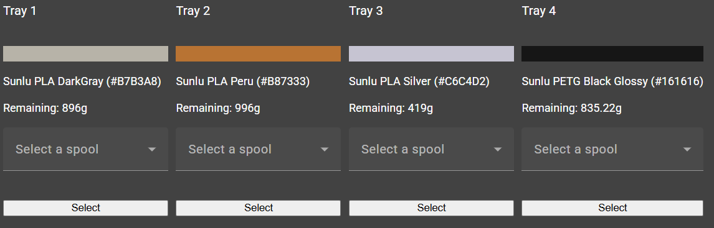

# Spoolman Updater API

## Overview

The Spoolman Updater API provides endpoints to manage spool updates, including tracking filament usage and material details. This API is designed to work with Home Assistant and other automation systems.

To facilitate API development and testing, the Spoolman Updater API utilizes Swagger for interactive API documentation. You can access the Swagger UI at http://<your-server>:8088/swagger, which allows you to explore and test the available endpoints.

> [!TIP]
> The new UI add abilities to set which spool is in which tray of the AMS. Also there is a scan button (top right) that allows you to scan a barcode/qrcode on a spool and that will lead to a page where you can set in which tray the spool is.

## Base URL

```
http://<your-server>:8088
```

## Environment Variables

The API requires the following environment variables to be set:


| Variable Name                                | Type          | Example                             | Description                                      |
| -----------------                            | ------------- | ----------------------------------- | ------------------------------------------------ |
| APPLICATION__HOMEASSISTANT__URL              | string        | https://192.169.1.1:8123            | The URL to Home Assistant, with portnumber       |
| APPLICATION__HOMEASSISTANT__TOKEN            | string        |                                     | The Home Assistant Long-lived access token [more info](https://community.home-assistant.io/t/how-to-get-long-lived-access-token/162159/5?u=marcokreeft87)       |
| APPLICATION__HOMEASSISTANT__AMSENTITIES__0   | string        | X1C_00xxxxxxxxxxxxx_AMS_1           | The Device ID of your AMS, when there are multiples AMS in your configuration just add another var and replace the _0 with _1 and so on       |
| APPLICATION__HOMEASSISTANT__AMSEXTERNALSPOOL | string        | sensor.x1x_externalspool_external_spool | The URL to Home Assistant, with portnumber       |
| APPLICATION__SPOOLMAN__URL                   | string        | https://192.169.1.1:7912             | The URL to Spoolman, with portnumber       |

## Running with Docker

### **Run the container**

```
docker run -d -p 8088:8080 \
  -e APPLICATION__HOMEASSISTANT__URL=http://homeassistant.local:8123 \
  -e APPLICATION__HOMEASSISTANT__TOKEN=your-token \
  -e APPLICATION__SPOOLMAN__URL=http://spoolman.local:7912 \
  -e APPLICATION__HOMEASSISTANT__AMSENTITIES__0=x1c_ams_1 \
  -e APPLICATION__HOMEASSISTANT__AMSEXTERNALSPOOL=sensor.x1c_external_spool \
  --name spoolman-updater spoolman-updater
```

## Using with Home Assistant
The Spoolman Updater API can be integrated into Home Assistant automations to track filament usage automatically.

### **1. Define a REST Command in `configuration.yaml`**
Add the following to your `configuration.yaml` to create a REST command that updates the spool:

```yaml
rest_command:
  update_spool:
    url: "http://<your-server>:8088/Spools/spool"
    method: POST
    headers:
      Content-Type: "application/json"
    payload: >
      {
        "name": "{{ name }}",
        "material": "{{ material }}",
        "tag_uid": "{{ tag_uid }}",
        "used_weight": {{ used_weight }},
        "color": "{{ color }}",
        "active_tray_id": "{{ filament_active_tray_id }}"
      }
```

### **2. Create an Automation**
The following automation updates the spool when a print finishes or when the AMS tray switches:

```yaml
alias: Bambulab - Update Spool When Print Finishes or Tray Switches
description: ""
triggers:
  - trigger: state
    entity_id:
      - sensor.x1c_active_tray_index
conditions:
  - condition: template
    value_template: "{{ trigger.from_state.state not in ['unknown', 'unavailable'] }}"
  - condition: template
    value_template: "{{ trigger.from_state.state | int > 0 }}"
actions:
  - variables:
      tray_number: >-
        {{ trigger.from_state.state if trigger.entity_id ==
        'sensor.x1c_active_tray_index' else
        states('sensor.x1c_active_tray_index') }}
      tray_sensor: sensor.x1c_00m09c422100420_ams_1_tray_{{ tray_number }}
      tray_weight: >-
        {{ states('sensor.bambulab_filament_usage_meter') | float(0) | round(2)
        }}
      tag_uid: "{{ state_attr(tray_sensor, 'tag_uid') }}"
      material: "{{ state_attr(tray_sensor, 'type') }}"
      name: "{{ state_attr(tray_sensor, 'name') }}"
      color: "{{ state_attr(tray_sensor, 'color') }}"
  - data:
      filament_name: "{{ name }}"
      filament_material: "{{ material }}"
      filament_tag_uid: "{{ tag_uid }}"
      filament_used_weight: "{{ tray_weight }}"
      filament_color: "{{ color }}"
      filament_active_tray_id: "{{ tray_sensor | replace('sensor.', '') }}"
    action: rest_command.update_spool
  - action: utility_meter.calibrate
    data:
      value: "0"
    target:
      entity_id: sensor.bambulab_filament_usage_meter

```

This automation ensures that the filament usage is automatically updated in Spoolman when a print is completed or the AMS tray is changed.

---

### Setting the active tray in the UI when switching spools
When you switch your spool in the AMS, you will need to tell spoolman which tray the new spool is in. You can do this in the UI of Spoolman updater.
Just go to the base of the URL of the API. So for example if your API url is http://192.168.2.186:8088/spools you go to http://192.168.2.186:8088/



Here you can set which spool is in which tray. 

## Contributing

Pull requests are welcome! Please follow the standard GitHub workflow:

1. Fork the repository
2. Create a feature branch
3. Submit a pull request

## License

MIT License. See `LICENSE` file for details.

